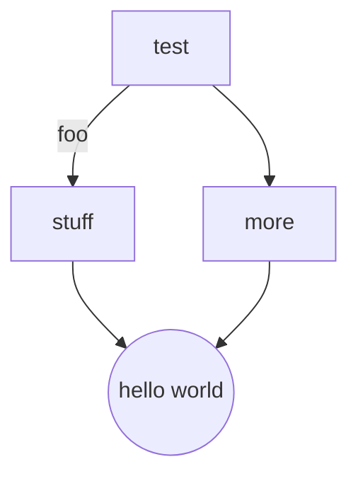

# Atom

Atom is an open-source text editor in which you can run code. The purpose of
this document is to help you get set up. You will want to install Markdown-
Preview-Enhanced. You will also want to make sure Kite installs. You will also want to enable Atom to run code.

Unless you really enjoy adding line-breaks and do not want your text to be
portable to other applications by mere copy-paste, then I suggest that you go into the settings and turn on 'soft wrap at guide' or somesuch. This will
actually cause your text to wrap at that guide at the edge of the screen.
However, you do not have to do this. When your markdown files are exported to PDF, all of these superfluous linebreaks will be removed. However, you may have to go through the extra effort of exporting each markdown file that you make to PDF automatically. It is up to you.

Go into settings/packages/tree-view and then check the boxes that ignore ignored files and turn off 'sort subdirectories first.'

You can edit scripts, and when you are done and ready to save, command+s and control+alt+e. Control+alt+e will generate a PDF.

<!-- more steps to follow -->

## Mermaid

